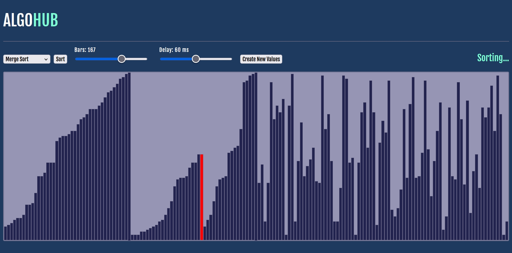
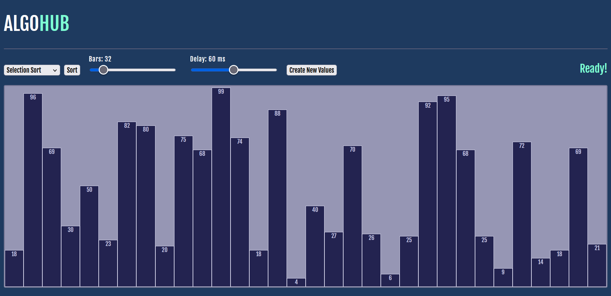

# AlgoHub
A javascript-based word game.

## How to Use:
Pick from (currently) 5 algorithms to sort randomly generated values. Users can control the number of bars as well as the speed of the sorting algorithm.

### Available Algorithms:
 • Bucket Sort\
 • Insertion Sort\
 • Selection Sort\
 • Merge Sort\
 • Quick Sort\